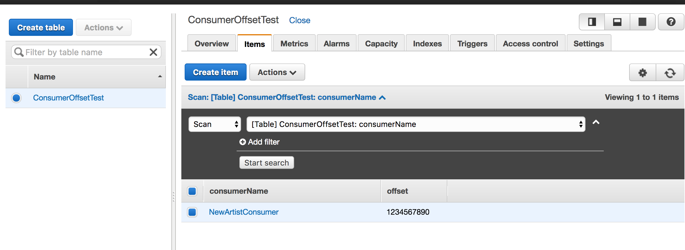

DynamoDB
--------

Ok, so you only define the PrimaryKey while creating a schema for a document, 
that's what I misunderstood from the beginning.

http://docs.aws.amazon.com/amazondynamodb/latest/developerguide/TicTacToe.Phase2.html#TicTacToe.Phase2.DataModel

```json
aws dynamodb describe-table --table-name Test_ConsumerOffset --profile aws-federated --region us-west-2

{  
   AttributeDefinitions:[  
      {  
         AttributeName:consumerOwner,
         AttributeType:S
      },
      {  
         AttributeName:offset,
         AttributeType:S
      }
   ],
   TableName:Test_ConsumerOffset,
   KeySchema:[  //PrimaryKey
      {  
         AttributeName:consumerOwner,
         KeyType:HASH
      },
      {  
         AttributeName:offset,
         KeyType:RANGE
      }
   ],
   ProvisionedThroughput:{  
      ReadCapacityUnits:10,
      WriteCapacityUnits:10
   }
}
```




```bash
aws dynamodb create-table --cli-input-json file://db/dynamodb/001-Customer.json --profile default

aws dynamodb put-item --table-name Customer --item file://db/dynamodb/002-CustomerData.json --profile default --return-consumed-capacity TOTAL
{
    "ConsumedCapacity": {
        "CapacityUnits": 6.0, 
        "TableName": "Customer"
    }
}

## search by primary key
aws dynamodb query --table-name Customer --projection-expression "lastVisitDate" --key-condition-expression "customerId = :c1" --expression-attribute-values file://db/dynamodb/customer-expression-attrs.json
{
    "Count": 1, 
    "Items": [
        {
            "lastVisitDate": {
                "S": "2020-01-27 01:02:03"
            }
        }
    ], 
    "ScannedCount": 1, 
    "ConsumedCapacity": null
}

## search by primary + secondary 
aws dynamodb query --table-name Customer --projection-expression "lastVisitDate" --key-condition-expression "customerId = :c1 and storeId = :s1" --expression-attribute-values file://db/dynamodb/customer-expression-attrs.json


## delete
aws dynamodb delete-table --table-name Customer --profile default
{
    "TableDescription": {
        "TableArn": "arn:aws:dynamodb:us-east-1:???:table/Customer", 
        "ProvisionedThroughput": {
            "NumberOfDecreasesToday": 0, 
            "WriteCapacityUnits": 5, 
            "ReadCapacityUnits": 5
        }, 
        "TableSizeBytes": 0, 
        "TableName": "Customer", 
        "TableStatus": "DELETING", 
        "TableId": "1f930975-efe7-45b9-950f-266313ab375a", 
        "ItemCount": 0
    }
}


```